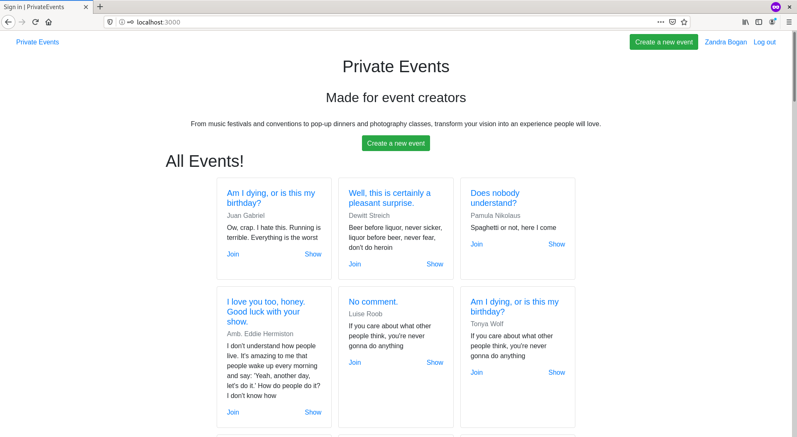

# Private Events

> A nice app to organize meetings! Inspired on [EventBrite](https://www.eventbrite.com/).



Additional description about the project and its features.

## Built With

- Ruby 2.7.0 on Rails 5.2.4
- CSS Bootstrap

## Live Demo

[Live Demo Link]()

## Getting Started

**This is an example of how you may give instructions on setting up your project locally.**
**Modify this file to match your project, remove sections that don't apply. For example: delete the testing section if the currect project doesn't require testing.**


To get a local copy up and running follow these simple tutorial:

### Steps to run

```console
git clone https://github.com/angel-mora/private-events.git
```

Go to the project folder

```console
cd private-events
bundle install
```
Update local database

```console
rails db:migrate
```
Run it locally

```console
rails s
```  
Then, open your browser and type: http://localhost:3000/

### Testing

Run the test from root directory using:

``` console
rspec
or 
rspec ./spec/path/to/file
```

## Authors

👤 **Angel Mora**

- Github: [@angel-mora](https://github.com/angel-mora)
- Twitter: [@angelmoma_](https://twitter.com/angelmoma_)
- Linkedin: [linkedin]( www.linkedin.com/in/angelmoradev)

## 🤝 Contributing

Contributions, issues and feature requests are welcome!

Feel free to check the [issues page](issues/).

## Show your support

Give a ⭐️ if you like this project!

## Acknowledgments

- Hat tip to anyone whose code was used
- Inspiration
- etc

## 📝 License

This project is [MIT](lic.url) licensed.


---

# Personal Learnings

- Pry/Appraisal debugging
- Helpers
- Faker gem

# Useful

If you can find a model with little dependencies, a good first integration test to write might be a test for updating a record.
Common integration tests:


1. Generate some test data
1. Log into the application
1. Visit the page I’m interested in
1. Perform whatever clicks and typing need to happen in order to exercise the feature I’m testing
1. Perform an *assertion*
